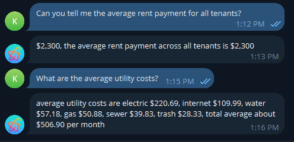

# OpenClaw Elastic Agent Builder Skill

An OpenClaw skill that enables direct conversational interaction with 
[Elastic Agent Builder](https://www.elastic.co/docs/explore-analyze/ai-features/elastic-agent-builder) agents running in Kibana.


This skill allows OpenClaw to:

-   Discover available Agent Builder agents
-   Maintain multi-turn conversations
-   Route user prompts to specific Elastic agents
-   Persist conversation state using `conversation_id`
-   Support Kibana Spaces
-   Override connectors and configuration dynamically

Rather than being just a script wrapper, this skill acts as a
conversational bridge between OpenClaw and Elastic’s Agent Builder
platform.

------------------------------------------------------------------------

# What This Skill Enables

Once installed, OpenClaw can:

-   Query real data-backed agents
-   Maintain conversational context across multiple turns
-   Dynamically switch between different Elastic agents
-   Reset conversations when needed
-   Integrate Elastic-powered reasoning directly into your OpenClaw
    workflows

This makes it ideal for building:

-   Internal analytics copilots
-   Search-backed knowledge agents
-   Data-driven operational bots

------------------------------------------------------------------------

# Installation

## 1️⃣ Folder Structure

Place the files in your OpenClaw workspace exactly as shown:

    workspace/
    └── skills/
        └── elastic-agent-builder/
            ├── SKILL.md
            ├── .env
            └── scripts/
                └── elastic_agent_builder.py

### Required Locations

-   `SKILL.md` → `workspace/skills/elastic-agent-builder/`
-   `.env` → `workspace/skills/elastic-agent-builder/`
-   `elastic_agent_builder.py` →
    `workspace/skills/elastic-agent-builder/scripts/`

------------------------------------------------------------------------

## 2️⃣ Configure Environment Variables

Create or update:

    workspace/skills/elastic-agent-builder/.env

Example:

``` env
KIBANA_URL=https://your-kibana-host
KIBANA_API_KEY=your_api_key_here
KIBANA_SPACE_ID=default
KIBANA_VERIFY_SSL=true
KIBANA_TIMEOUT_S=300
DEFAULT_AGENT_ID=elastic-ai-agent
```

# How It Works Inside OpenClaw

When invoked, the skill:

1.  Authenticates to Kibana using an API key
2.  Retrieves available Agent Builder agents
3.  Sends user input to `/api/agent_builder/converse`
4.  Maintains `conversation_id` for stateful multi-turn conversations
5.  Returns structured responses back into OpenClaw

The skill supports:

-   Agent switching
-   Conversation resets
-   Raw JSON responses (for debugging)
-   Connector overrides
-   Configuration overrides

------------------------------------------------------------------------

# Example: Property Management Agent

Below is an example interaction with a property management agent powered
by Elastic Agent Builder.

The agent answers real operational questions such as:

-   “What is the average rent payment?”
-   “What are the average utility costs?”



------------------------------------------------------------------------

# Security Considerations

This skill uses API key authentication to communicate with Kibana.

-   Restrict API key permissions to only required Agent Builder
    endpoints
-   Store secrets in a secure vault or secret manager
